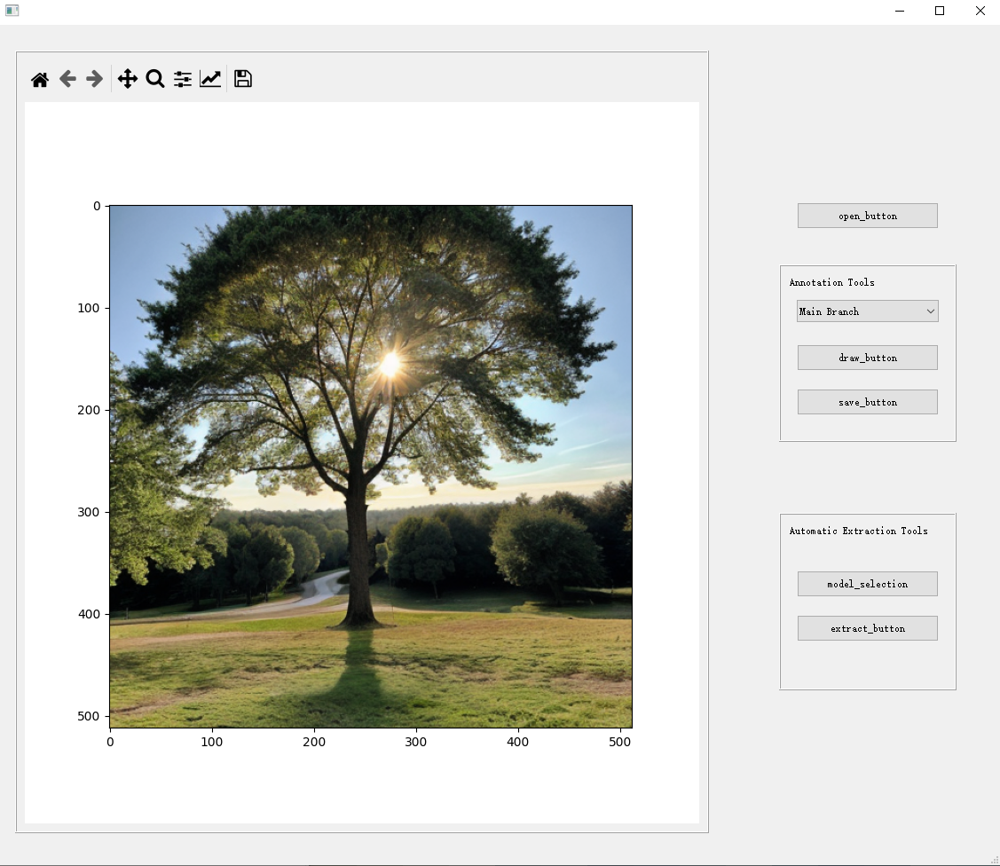

# -Tree-Branch-Annotation-and-Prediction-Tool
A Comprehensive Tool for Annotating and Predicting Tree Branch Structures

<div align="center">
  <a href="https://doi.org/10.3390/f15091659">
    
  </a>

  <h1>Tree Branch Annotation and Prediction Tool</h1>

  <p>
  A tool for annotating and predicting tree branching structures from RGB images.
  </p>

  <p>
    <a href="https://github.com/your-username/tree-branch-annotation/blob/main/LICENSE">
      
    </a>
    <a href="https://github.com/your-username/tree-branch-annotation">
      
    </a>
    <a href="https://doi.org/10.3390/f15091659">
      
    </a>
  </p>
</div>

---

## Table of Contents

- [Introduction](#introduction)
- [Features](#features)
- [Installation](#installation)
- [Usage](#usage)
- [Pre-trained Models](#pre-trained-models)
- [Sample Dataset](#sample-dataset)
- [Project Structure](#project-structure)
- [Citing this Work](#citing-this-work)
- [License](#license)

---

## Introduction

This repository provides the software developed for the research paper:  
[**Automatic Method for Extracting Tree Branching Structures from a Single RGB Image**](https://doi.org/10.3390/f15091659) (**doi: 10.3390/f15091659**).  

The tool offers functionalities for:
- Annotating tree branch structures interactively.
- Predicting tree branch structures using pre-trained deep learning models.
- Generating datasets for training branch prediction models.
- Accessing pre-trained models and sample datasets.

---

## Features

- **Annotation Tool**:  
  Annotate main trunks and primary branches interactively on RGB images.
- **Prediction Functionality**:  
  Use pre-trained deep learning models to predict tree branch structures.
- **Dataset Generation**:  
  Save annotations as structured XML files for dataset creation.
- **Pre-trained Models**:  
  Access models trained for **400 epochs** and **1200 epochs**.
- **Sample Dataset**:  
  Utilize copyright-free images and annotations for testing and reference.

---

## Installation

### Prerequisites

Ensure you have the following installed:
- Python 3.8+
- PyTorch
- PyQt5
- NumPy, OpenCV, Matplotlib, Pillow

### Clone the Repository

```bash
git clone https://github.com/your-username/tree-branch-annotation.git
cd tree-branch-annotation

